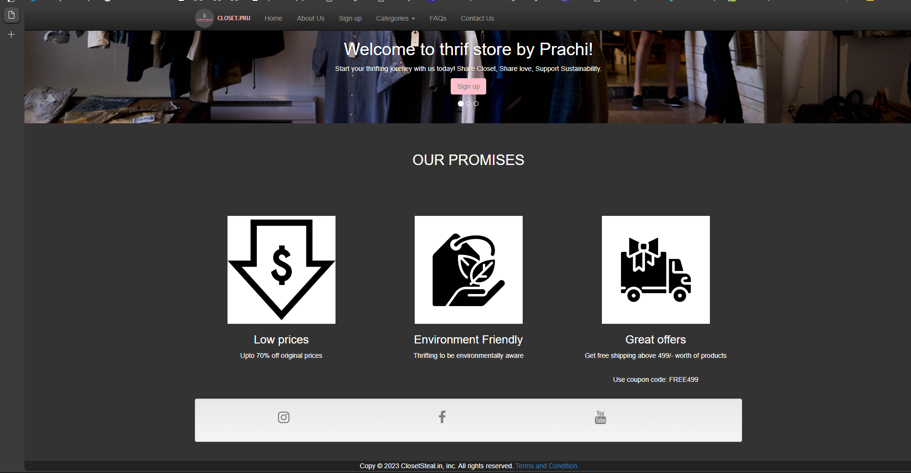
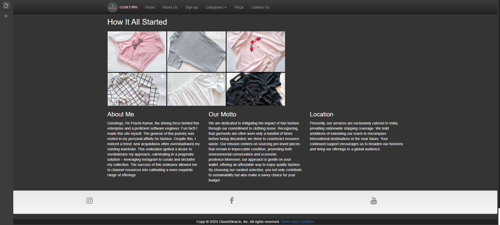
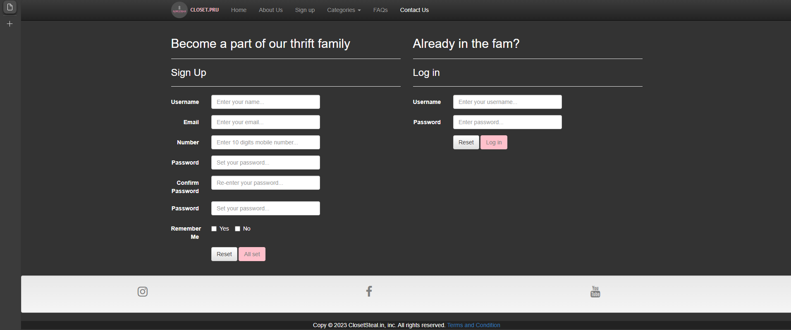
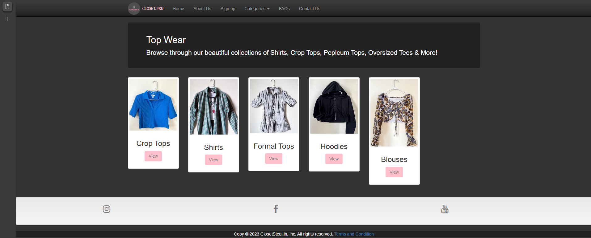
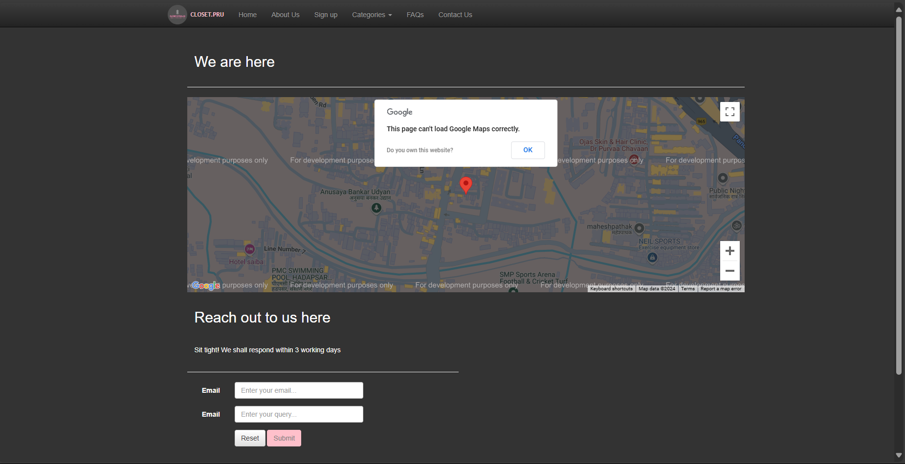

# Thrift-Store-Website
I created the frontend for an online thrift store I used to earn from. Just a fun project I started to take orders from this website. This repo only has the frontend, backend development is in process.

### Tools & Technologies used 
HTML 5
CSS3
JavaScript
Twitter Bootstrap 3
Bootstrap5
Jquery, Jquery UI
Google APIs 
Social Plugins 

## Website 










## Running the Bootstrap Webpage Locally

### Prerequisites
- **Web Browser**: Ensure you have a modern web browser installed (e.g., Chrome, Firefox, Edge).

### Steps to Run the Webpage

1. **Download the Project Files**:
   - Clone the repository or download the ZIP file containing the project files.
   ```bash
   git clone https://github.com/your_username/your_repository_name.git
2. **Open the HTML File**:
   - Locate the main HTML file (e.g., index.html) and open it in your web browser.

##Note 
Some Webpages in the categories section are not implemented
The Directory might look messy as I missed creating a folder for all my images. You may make one and change the respective paths in the code.
